<div align="center">



<br />

<a href="https://bablu-six.vercel.app/"></a>
<a href="https://www.linkedin.com/in/babludangi"></a>
<a href="mailto:babludangi2000@gmail.com"></a>
<a href="https://www.instagram.com/bablu_patel__9788/"></a>

<sub><a href="#positioning">Positioning</a> &nbsp;·&nbsp; <a href="#systems">Selected Systems</a> &nbsp;·&nbsp; <a href="#capabilities">Capabilities</a> &nbsp;·&nbsp; <a href="#approach">Approach</a> &nbsp;·&nbsp; <a href="#timeline">Timeline</a> &nbsp;·&nbsp; <a href="#contact">Contact</a></sub>

</div>


<a id="positioning"></a>

### Positioning

> I design and ship **production web platforms** and the **AI layers** that make them useful — from the data model and API surface to retrieval pipelines and the interface people actually touch.
>
> My work spans government-scale data systems, fintech, education, manufacturing ERP and hospitality. The common thread: **clear boundaries, predictable behaviour under failure, and software a small team can own.**

<br />

| | |
|:--|:--|
| **Role** | Full Stack Developer — Technoboot Pvt. Ltd. |
| **Core stack** | MERN · Java / Spring Boot |
| **Applied AI** | RAG pipelines · LLM integration · vector search · semantic chunking |
| **Domains** | Government data · Fintech · Ed-tech · Manufacturing ERP · Hospitality |
| **Based in** | Assam, India — working with distributed teams |
| **Open to** | AI-product engineering · Freelance builds · Focused collaborations |


<a id="systems"></a>

### Selected Systems

<table>
<tr>
<td width="50%" valign="top">

**ICAR-CIWA / NISWA**
<br /><sub>`GOVERNMENT · DATA PLATFORM · RAG`</sub>

National-scale agricultural household database supporting Government of India policy research.

- Multilingual semantic search on a **LangChain RAG pipeline** (Node.js)
- LLM-driven auto-tagging of records
- Built for large datasets, role separation and auditability

</td>
<td width="50%" valign="top">

**Manufacturing ERP**
<br /><sub>`ENTERPRISE · WORKFLOW · DOCUMENTS`</sub>

Role-based ERP for a manufacturing client with technical documentation.

- **7 user profiles** across **10 modules**
- **15+ documents** generated automatically from workflow data
- Permission model designed around real shop-floor and office roles

</td>
</tr>
<tr>
<td valign="top">

**Repomind**
<br /><sub>`AI SAAS · DEVELOPER TOOLING · IN PROGRESS`</sub>

Codebase Q&A for small engineering teams — ask questions in plain language, get answers grounded in the repository.

- **tree-sitter** semantic chunking so retrieval follows code structure
- **Qdrant** for vector search, local and cloud embeddings
- Freemium model: architecture, prompts and monetisation designed together

</td>
<td valign="top">

**MatchMind**
<br /><sub>`HIRING · MATCHING · SPRING BOOT`</sub>

AI-assisted job matching and ATS platform.

- **Java Spring Boot + MongoDB** core
- Matching logic designed to run on free-tier infrastructure
- Structured for incremental model upgrades without reworking the API

</td>
</tr>
<tr>
<td valign="top">

**Hiring Call Bot**
<br /><sub>`VOICE AI · RECRUITMENT · MERN`</sub>

Inbound voice screening platform for blue-collar job seekers.

- Conversational call flow with structured candidate capture
- Designed for low-literacy, high-volume, multilingual callers

</td>
<td valign="top">

**Client Platforms**
<br /><sub>`AKG PROPERTIES · TRAVEL CULTURE · RESUME BUILDER`</sub>

Production sites and tools delivered end to end.

- Real-estate suite: API, public web and admin console (Buy / Sell / Rent)
- Travel storefront with SEO and WhatsApp enquiry flow
- Resume builder with live preview and PDF export

</td>
</tr>
</table>


<a id="capabilities"></a>

### Capabilities

<table>
<tr>
<td width="22%"><b>Frontend</b></td>
<td>


</td>
</tr>
<tr>
<td><b>Backend</b></td>
<td>


</td>
</tr>
<tr>
<td><b>Data</b></td>
<td>


</td>
</tr>
<tr>
<td><b>Applied AI</b></td>
<td>


</td>
</tr>
<tr>
<td><b>Delivery</b></td>
<td>


</td>
</tr>
</table>


<a id="approach"></a>

### Engineering Approach

<table>
<tr>
<td width="25%" valign="top"><b>01 — Boundaries first</b><br /><sub>Model the domain and permissions before screens. Most production bugs are boundary bugs.</sub></td>
<td width="25%" valign="top"><b>02 — Design for failure</b><br /><sub>Validation, retries, queues and sensible empty states are part of the feature, not an afterthought.</sub></td>
<td width="25%" valign="top"><b>03 — Pragmatic AI</b><br /><sub>Use retrieval and LLMs where they remove real work. Measure quality, cost and latency, then simplify.</sub></td>
<td width="25%" valign="top"><b>04 — Ownable systems</b><br /><sub>Small teams should be able to run, debug and extend what ships. Boring tech, clear structure.</sub></td>
</tr>
</table>


<a id="timeline"></a>

### Timeline

```text
NOW        Full Stack Developer          Technoboot Pvt. Ltd.
           MERN and Spring Boot platforms; RAG search and LLM tagging for a national data system;
           role-based ERP; ongoing AI SaaS builds (Repomind, MatchMind)

EARLIER    Fintech Intern                Credmarg Technologies, Hyderabad
           Financial workflows and user operations in a production fintech product

           Java Intern                   Ypsilon IT Solutions
           Java back-end fundamentals in a team delivery setting

TRAINING   Java Full Stack Development   Universal Informatics
           Full Stack Developer          Sathya Technologies, Hyderabad
```


<a id="contact"></a>

### Contact

For product engineering, AI feature work or a well-scoped build, the quickest route is email.

<div align="center">

<a href="mailto:babludangi2000@gmail.com"></a>
<a href="https://www.linkedin.com/in/babludangi"></a>
<a href="https://bablu-six.vercel.app/"></a>

<br /><br />


</div>
